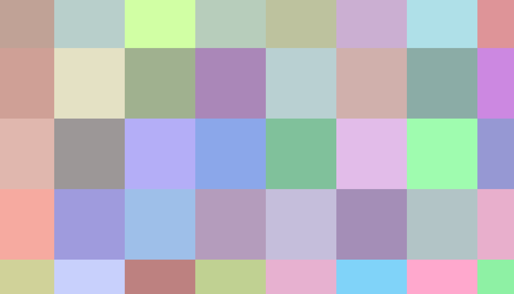

# Zappar for ThreeJS

## Standalone Bootstrap Project

In this project you'll find the following files that get you up and running with Zappar for ThreeJS.

- _index.html_: contains the basic structure of you page and any necessary HTML UI elements
- _index.js_: contains the code the sets up your ThreeJS scene and AR experience

Head to the NPM package page for more information on how to build best-in-class AR experiences: [Zappar for ThreeJS](https://www.npmjs.com/package/@zappar/zappar-threejs) (@zappar/zappar-threejs)

## Preview

Scan the QR code below using your native camera app or QR code reader to view the example:
​


### Local Preview and Testing

Due to browser restrictions surrounding use of the camera, you must use HTTPS to view or preview your site, even if doing so locally from your computer. If you're using `webpack`, consider using `webpack-dev-server` which has an `https` option to enable this.

Alternatively you can use the [ZapWorks command-line tool](https://www.npmjs.com/package/@zappar/zapworks-cli) to serve a folder over HTTPS for access on your local computer, like this:

```
zapworks serve .
```

The command also lets you serve the folder for access by other devices on your local network, like this:

```
zapworks serve . --lan
```

## Target Image


